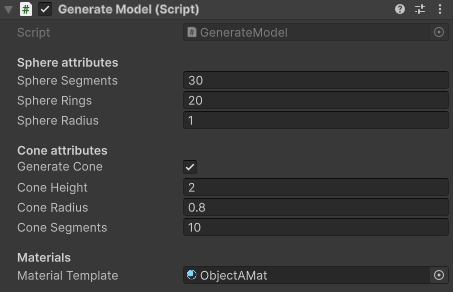
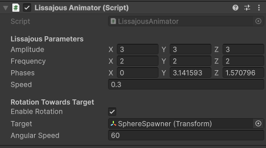

# XARTest

## Setup

### Cloning
```bash
git clone https://github.com/CodeJackk/XARTest.git
```

### Version
This project was made in Unity 6 - URP. The project should be backwards compatible with any version > 2023.

### Scene
The scripts are attached to two spawner objects:
- **`SphereConeSpawner`** (objectA)
- **`SphereSpawner`** (objectB)

Simply press play, no setup needed. You can adjust the parameters below.

---

## Implementation

### Procedural Mesh Creation

**`GenerateModel.cs`**
- Programmatically generates a sphere mesh with the option of a cone mesh generated on the sphere's forward axis.
- Several parameters are available to change regarding size and mesh resolution.




### Lissajous Animation & Rotation

**`LissajousAnimator.cs`**
- Handles the curve to follow in 3D space for both objects.
- Parameters can be changed for:
  - Speed
  - Phase
- Points Object A towards Object B by modifying the look-at vector.
- Angular speed can be adjusted to vary how quickly it points towards Object B's position.



### Colour Change & Perlin

**`ObjectAShader.shader`**
- **Colour Change (fragment):**
  - Red when facing Object B.
  - Blue when away.
  - Gradient based on the dot product.
- **Perlin Noise (vertex):**
  - Smoothed Perlin noise applied in the direction of the sphere normals to create an organic blob effect.
- Additional metallic and reflection calculations added for visual enhancement.

### Video example

(or see example_video in /readmefiles)

[](https://www.youtube.com/watch?v=508xsazTxxo)
